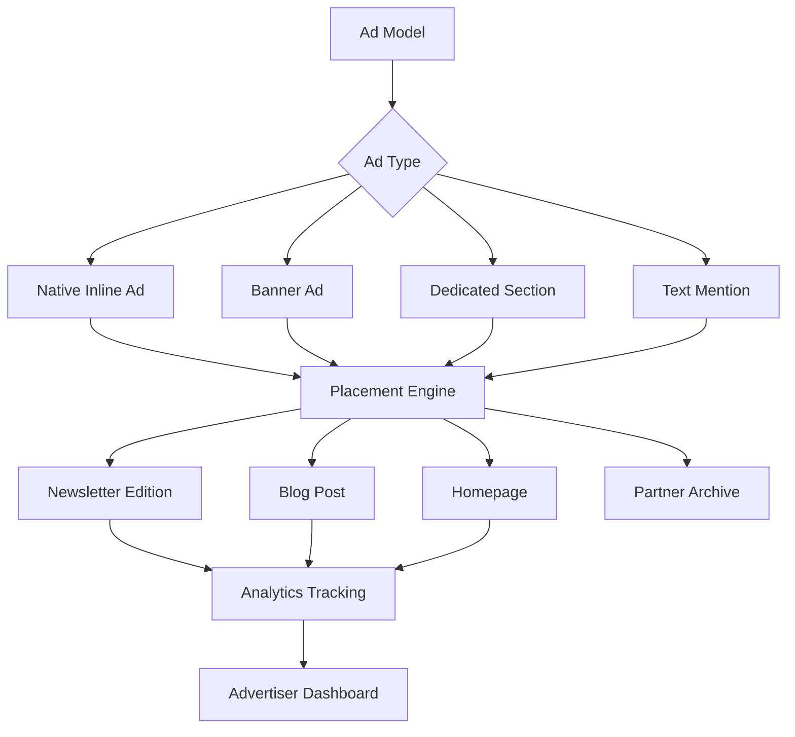

# Every.to-Style Advertising Implementation Plan

## Overview

Based on research of Every.to and modern newsletter advertising best practices, this plan outlines how to implement a sophisticated, native advertising system for Hudson Life Dispatch that integrates seamlessly into both newsletters and website content.

## Key Principles from Every.to

1. **Native Integration** - Ads blend naturally with content
2. **Multiple Touchpoints** - Sponsors appear across newsletter, website, and social
3. **Clear Labeling** - Transparent "SPONSORED" badges maintain trust
4. **Premium Positioning** - Strategic placement for maximum visibility
5. **Performance Tracking** - Detailed analytics for advertisers

## Ad Format Types

### 1. Native Inline Ads (Primary Format)
**Description:** Sponsor content that appears as a natural part of the newsletter/article flow

**Characteristics:**
- Looks like regular content but clearly labeled "SPONSORED"
- Includes sponsor logo, headline, description, and CTA
- 2-3 sentence description maximum
- Single clear call-to-action button
- Subtle background color or border to distinguish from content

**Placement Options:**
- After intro paragraph (premium position)
- Between content sections (mid-content)
- Before footer (standard position)

### 2. Banner Ads
**Description:** Visual display ads with images

**Characteristics:**
- Image-based (300x250, 728x90, or custom sizes)
- Sponsor logo + tagline
- Click-through to sponsor URL
- "SPONSORED" label

**Placement Options:**
- Newsletter header (above content)
- Newsletter sidebar
- Website sidebar
- Between blog posts

### 3. Dedicated Sponsor Sections
**Description:** Full section dedicated to sponsor content

**Characteristics:**
- Entire newsletter section or article
- Clearly marked as "Partner Content" or "Sponsored Content"
- Can include multiple paragraphs, images, links
- Maintains editorial quality standards

**Placement Options:**
- Dedicated newsletter edition
- Featured homepage placement
- Permanent archive in "Partner Content" section

### 4. Text-Only Sponsor Mentions
**Description:** Brief sponsor acknowledgment

**Characteristics:**
- 1-2 sentences
- "This newsletter is brought to you by [Sponsor]"
- Simple text link
- Appears at top or bottom of newsletter

## Implementation Architecture



## Database Schema Updates

### New Fields for `ads` Table

```sql
-- Ad format and display
ad_format ENUM('native_inline', 'banner', 'dedicated', 'text_mention')
sponsor_logo_url VARCHAR(255)
sponsor_tagline VARCHAR(255)
background_color VARCHAR(7) -- hex color for native ads
border_style VARCHAR(50) -- 'subtle', 'none', 'bold'

-- Content fields for native ads
headline VARCHAR(255)
body_text TEXT -- 2-3 sentences for native inline
cta_button_text VARCHAR(50)
cta_button_color VARCHAR(7)

-- Positioning
position_in_content ENUM('after_intro', 'mid_content', 'before_footer', 'sidebar', 'header', 'dedicated')
priority INT -- for multiple ads in same placement

-- Performance tracking
view_duration_avg INT -- average seconds viewed
engagement_score FLOAT -- calculated metric

-- Sponsor relationship
sponsor_package_tier ENUM('basic', 'standard', 'premium', 'enterprise')
multi_channel BOOLEAN -- appears in newsletter + website + social
```

### New Table: `ad_performances`

```sql
CREATE TABLE ad_performances (
    id UUID PRIMARY KEY,
    ad_id UUID REFERENCES ads(id),
    placement_type VARCHAR(50), -- 'newsletter', 'blog_post', 'homepage'
    placement_id UUID, -- newsletter_edition_id or post_id
    impressions INT DEFAULT 0,
    clicks INT DEFAULT 0,
    ctr FLOAT,
    avg_view_duration INT,
    date DATE,
    created_at TIMESTAMP,
    updated_at TIMESTAMP
);
```

### New Table: `sponsor_packages`

```sql
CREATE TABLE sponsor_packages (
    id UUID PRIMARY KEY,
    name VARCHAR(100),
    tier ENUM('basic', 'standard', 'premium', 'enterprise'),
    price_per_month DECIMAL(10,2),
    includes_newsletter BOOLEAN,
    includes_website BOOLEAN,
    includes_social BOOLEAN,
    includes_dedicated_post BOOLEAN,
    max_active_ads INT,
    priority_level INT,
    description TEXT,
    created_at TIMESTAMP,
    updated_at TIMESTAMP
);
```

## Filament Admin Updates

### 1. Enhanced AdResource Form

Add new section: **"Ad Format & Display"**

Fields:
- **Ad Format** (Select): Native Inline, Banner, Dedicated Section, Text Mention
- **Sponsor Logo** (FileUpload): Logo image
- **Sponsor Tagline** (TextInput): Short tagline
- **Headline** (TextInput): Main ad headline (for native ads)
- **Body Text** (Textarea): 2-3 sentences (for native ads)
- **CTA Button Text** (TextInput): e.g., "Learn More", "Get Started"
- **CTA Button Color** (ColorPicker): Brand color
- **Background Color** (ColorPicker): Subtle background for native ads
- **Position in Content** (Select): After Intro, Mid-Content, Before Footer, etc.
- **Priority** (Number): For ordering multiple ads

### 2. New Resource: SponsorPackageResource

Manage sponsor packages and pricing tiers:
- Package name and tier
- Pricing
- Features included
- Active sponsors on this package

### 3. New Widget: AdPerformanceDashboard

Display on Filament dashboard:
- Total impressions/clicks by ad
- CTR by placement type
- Revenue by sponsor
- Top performing ads
- Upcoming ad expirations

### 4. Ad Preview Component

Live preview of how ad will appear in:
- Newsletter format
- Blog post format
- Homepage format

## Frontend Implementation

### 1. New Component: `NativeInlineAd.tsx`

```typescript
interface NativeInlineAdProps {
  ad: {
    sponsor_name: string;
    sponsor_logo_url: string;
    sponsor_tagline: string;
    headline: string;
    body_text: string;
    cta_text: string;
    cta_url: string;
    background_color?: string;
  };
}
```

Renders a native-looking ad block with:
- "SPONSORED" badge
- Sponsor logo
- Headline and body
- CTA button
- Subtle styling to blend with content

### 2. New Component: `BannerAd.tsx`

Standard banner ad component with image and click tracking

### 3. New Component: `TextSponsorMention.tsx`

Simple text-based sponsor acknowledgment

### 4. Ad Injection Logic

**For Newsletter:**
- Parse newsletter content
- Inject ads at specified positions
- Track impressions when newsletter is opened

**For Blog Posts:**
- Fetch active ads for 'blog' placement
- Inject after X paragraphs based on position setting
- Track impressions on page view

**For Homepage:**
- Fetch active ads for 'home' placement
- Display in designated ad zones
- Rotate ads based on priority

### 5. Analytics Tracking

```typescript
// Track ad impression
trackAdImpression(adId, placementType, placementId);

// Track ad click
trackAdClick(adId, placementType, placementId);

// Track view duration (time ad is in viewport)
trackAdViewDuration(adId, duration);
```

## API Endpoints

### Public Endpoints

```
GET /api/ads/active
  ?placement=newsletter
  &edition_id=123
  &position=after_intro
  
GET /api/ads/active
  ?placement=blog
  &post_id=456
  &position=mid_content

POST /api/ads/{id}/impression
  body: { placement_type, placement_id }

POST /api/ads/{id}/click
  body: { placement_type, placement_id, referrer }
```

### Admin Endpoints

```
GET /api/admin/ads/performance
  ?date_from=2025-01-01
  &date_to=2025-01-31
  &sponsor_id=789

GET /api/admin/sponsors/revenue
  ?year=2025
```

## Sponsor Packages

### Basic Package ($500/month)
- 1 native inline ad in weekly newsletter
- Listed in sponsor archive
- Basic analytics

### Standard Package ($1,500/month)
- 2 native inline ads in newsletter
- 1 banner ad on website sidebar
- Social media mention
- Detailed analytics

### Premium Package ($3,500/month)
- 4 native inline ads in newsletter
- Homepage banner placement
- 1 dedicated sponsor section per month
- Social media stories
- Priority support
- Advanced analytics dashboard

### Enterprise Package (Custom pricing)
- Unlimited ad placements
- Dedicated account manager
- Custom ad formats
- Multi-month campaigns
- Co-branded content opportunities

## Implementation Phases

### Phase 1: Database & Models (Week 1)
- [ ] Create migrations for new ad fields
- [ ] Create sponsor_packages table
- [ ] Create ad_performances table
- [ ] Update Ad model with new fields and relationships
- [ ] Create SponsorPackage model
- [ ] Create AdPerformance model

### Phase 2: Admin Interface (Week 2)
- [ ] Update AdResource form with new format fields
- [ ] Add ad preview functionality
- [ ] Create SponsorPackageResource
- [ ] Build AdPerformanceDashboard widget
- [ ] Add bulk ad operations

### Phase 3: Frontend Components (Week 3)
- [ ] Build NativeInlineAd component
- [ ] Build BannerAd component
- [ ] Build TextSponsorMention component
- [ ] Implement ad injection logic for newsletters
- [ ] Implement ad injection logic for blog posts
- [ ] Add homepage ad zones

### Phase 4: Analytics & Tracking (Week 4)
- [ ] Implement impression tracking
- [ ] Implement click tracking
- [ ] Implement view duration tracking
- [ ] Build advertiser dashboard
- [ ] Create performance reports
- [ ] Email reports to sponsors

### Phase 5: Polish & Launch (Week 5)
- [ ] Create sponsor media kit
- [ ] Build public "Advertise with Us" page
- [ ] Test all ad formats
- [ ] Train team on ad management
- [ ] Soft launch with first sponsor

## Success Metrics

- **Ad CTR**: Target 2-5% (newsletter average)
- **Sponsor Retention**: Target 80% renewal rate
- **Revenue Goal**: $10,000/month by month 6
- **User Experience**: Maintain newsletter open rate above 35%
- **Transparency**: 100% of ads clearly labeled

## Key Differentiators from Current System

1. **Native Format**: Ads blend naturally with content (like Every.to)
2. **Multi-Channel**: Single ad appears in newsletter + website + social
3. **Performance Tracking**: Detailed analytics per placement
4. **Package Tiers**: Structured pricing for different sponsor needs
5. **Preview System**: Sponsors see exactly how ads will appear
6. **Automated Reporting**: Weekly performance emails to sponsors

## Next Steps

1. Review and approve this plan
2. Prioritize which phases to implement first
3. Determine if we want to start with newsletter-only or full multi-channel
4. Decide on initial sponsor package pricing
5. Begin Phase 1 implementation

